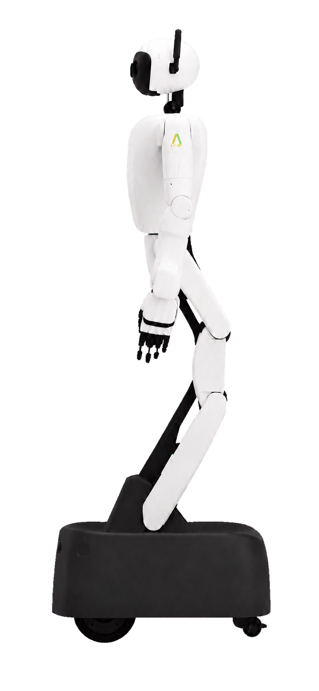

# 크래쉬랩 M1 강의 덱 — 디자인 기획서 v3
2026-08-21. **v1·v2·v2.1 전부 폐기. 이 문서가 유일한 정본이다.**

## 0. v2가 실패한 이유

내가 슬라이드 형식을 **하나로 못 박았다.** 그 결과:

- 75장이 전부 `eyebrow → 제목 → 가운데 그림 → 하단 회색 박스 3개` 로 똑같다
- 화면 위아래 25%씩이 **비어 있고** 내용은 가운데 절반에만 몰려 있다
- 모든 요소가 **선(outline)뿐**이다. 채운 면이 없어 화면이 창백하다
- 실습 슬라이드는 "작성 예정"이 5번 반복돼 **미완성 페이지처럼** 보인다
- 다이어그램이 디자인된 그래픽이 아니라 **와이어프레임 스케치** 수준이다

형식을 하나로 고정한 것이 근본 원인이다. 아래로 대체한다.

## 1. 그리드와 리듬 — 먼저 여백부터 고친다

1920×1080 기준.

- 좌우 마진 **120px**, 12칼럼 그리드, 거터 32px
- **콘텐츠는 세로 80%를 채운다.** 지금처럼 가운데 절반에 몰지 않는다
- 제목 블록 baseline은 상단에서 **200px** 고정 (전 슬라이드 공통)
- 본문 영역은 **y=320 ~ y=980**. 이 안을 채운다
- 하단 슬라이드 번호 외에는 y>1000 에 아무것도 두지 않는다

## 2. 레이아웃 6종 — 하나가 아니라 여섯

내용에 맞는 것을 고른다. 같은 레이아웃이 3장 연속 나오면 안 된다.

### L1 · 타이틀
한양 블루 **단색 전면**. 흰 글자. 강의 번호를 96px로 크게, 제목 72px, 목표 한 줄 34px.
유일하게 배경이 남색인 슬라이드다.

### L2 · 질문
연한 그린 틴트 배경. 질문만 **56px로 화면 중앙**에. 다른 요소 일절 없음.
말 그대로 비워서 강사가 학생을 쳐다볼 시간을 만든다.

### L3 · 다이어그램 지배
**그림이 화면의 70%를 차지한다.** 폭 1400px 이상, 높이 600px 이상.
설명은 하단 박스가 아니라 **그림 위에 직접 주석**으로 붙인다(리더선 + 점).
텍스트는 그림 아래 한 줄만.

### L4 · 분할
좌 5칼럼 개념 텍스트 / 우 7칼럼 그림. 좌우 정렬 baseline을 맞춘다.
텍스트가 그림을 설명해야 하는 경우에 쓴다.

### L5 · 비교
좌우 두 덩어리. **각 덩어리에 서로 다른 배경**(왼쪽 `#F5F7FA`, 오른쪽 `#EDF6E3`)을 깔아
경계를 색으로 만든다. 가운데 vs 구분자.

### L6 · 실습
아래 §5 참조. 워크시트로 다시 만든다.

## 3. 다이어그램 시각 언어 — 와이어프레임 탈피

지금 그림들은 선만 있어서 창백하다. 다음을 규칙으로 한다.

### 3-1. 면을 채운다
- 주요 노드는 **한양 블루 단색 채움 + 흰 글자**. 테두리만 있는 박스로 두지 않는다
- 보조 노드는 `#EDF6E3` 채움 + 남색 글자
- 배경 영역(맵, 그래프 판)은 `#F5F7FA` 채움 + 테두리 없음

### 3-2. 선 굵기는 두 가지만
- **2px** 구조선(축, 격자, 보조)
- **5px** 강조선(주 흐름, 경로, 데이터)
- 그 사이 굵기를 쓰지 않는다. 일관성이 정돈감을 만든다

### 3-3. 주석은 리더선으로
라벨을 도형에 붙이지 말고 **작은 채운 원(r=5) + 2px 리더선 + 라벨** 로 뺀다.
선이 글자를 관통하는 문제가 구조적으로 사라진다.

### 3-4. 숫자는 다르게 다룬다
수치(비용 18, 2.6 m, ±5%)는 **28px bold + 남색**, 단위는 20px regular 회색.
숫자가 그림의 결론인 경우가 많으므로 눈에 먼저 들어와야 한다.

### 3-5. 그림 판
모든 다이어그램은 `#FAFAFA` 카드 위에 올린다. radius 16px, 안쪽 여백 48px.
그림이 허공에 뜨지 않게 한다.

## 4. 하단 회색 박스 3개를 없앤다

전 슬라이드에 반복돼 가장 단조로운 요소다. 대신 셋 중 하나를 쓴다.

1. **핵심 한 줄** — 40px, 남색, 좌측 정렬. 그림 아래 한 문장만
2. **그림 위 주석** — 설명을 다이어그램 안으로 옮긴다 (L3에서 기본)
3. **2단 대비** — 비교가 필요할 때만 좌우 두 덩어리

3개를 나란히 놓는 배치는 **비교 슬라이드에서만** 허용한다.

## 5. 실습 슬라이드 — 워크시트로

지금은 "작성 예정" 5개가 깔려 미완성처럼 보인다. 이렇게 바꾼다.

- 상단에 **그린 단색 헤더 바**(높이 80px) + 흰 글자로 실습 제목
- 본문은 **흰 배경 워크시트**. 배경 틴트를 깔지 않는다
- "작성 예정" 문구를 **전부 제거**한다. 대신 빈 줄(밑줄 2px `#E5E5E5`)만 둔다
- 단계는 큰 숫자 뱃지(원, 그린 채움, 흰 숫자 32px) + 빈 줄
- 빈칸 주석도 실습 슬라이드와 함께 제거한다.

빈 칸이 "아직 안 만든 것"이 아니라 "채우라고 만든 자리"로 보여야 한다.

## 6. 강의별 악센트

4개 덱이 구분되도록 강의마다 보조색을 하나씩 준다. 주색(한양 블루)은 공통.

| 강의 | 악센트 | 쓰는 곳 |
|---|---|---|
| ① 로보틱스·ROS2 | `#75B446` 그린 | eyebrow, 진행바, 강조 |
| ② 조작·제어 | `#00A0B0` 청록 | 〃 |
| ③ VSLAM | `#F7931E` 오렌지 | 〃 |
| ④ VLA | `#7B5EA7` 보라 | 〃 |

악센트는 **강조에만** 쓴다. 면적을 많이 차지하면 안 된다.

## 7. 타이포 위계 (프로젝터 기준 유지)

| 요소 | 크기 | 굵기 |
|---|---|---|
| 강의 번호 (L1) | 96px | 700 |
| 슬라이드 제목 | 64px | 700 |
| 질문 (L2) | 56px | 700 |
| 핵심 한 줄 | 40px | 600 |
| 본문·라벨 | 28px | 400 |
| 수치 | 28px | 700 |
| 다이어그램 라벨 | 22px | 500 |
| eyebrow | 18px | 600 · letter-spacing .12em |

## 8. 유지할 것

- 슬라이드 59장 구성(16/14/15/14)과 강의 슬롯 순서
- 한양 블루 `#1D2475` 주색
- 인라인 SVG, 외부 요청은 Google Fonts만
- 키보드 네비게이션, 접근성 속성
- 겹침·가림 0건 (tools/audit-overlap.html, tools/audit-occlusion.html)

---

# v4 개정 — 구성(composition) 원칙
2026-08-21. 사용자 지정 레퍼런스(Wix "2025 최고의 웹사이트 디자인 31") 분석 반영.
**이 절이 §2 레이아웃보다 우선한다.**

## A. 지금까지 실패한 진짜 이유

부품(색·타이포·컴포넌트)은 v2·v3·SVG규격으로 정리됐다. 그런데도 어색한 이유는 **구성**이다.

강의2 s8 시안에서 확인:
- 순환 개념을 **가로 파이프라인 + 리턴선**으로 그려 순환으로 안 읽힌다
- 가운데 원판이 아무것과도 연결되지 않는다 (Tufte 가 말한 chartjunk)
- 세로 400px이 선 하나로 채워진 빈 공간이다
- 노드 하나가 viewBox 밖으로 잘렸다

## B. 레퍼런스에서 가져올 것

### B-1. 비대칭으로 균형 잡기 ★ 가장 중요

> "최고의 홈페이지 디자인 대부분이 대칭 레이아웃을 쓰지만 OK Drugs는 **비대칭 방식으로 균형**을 이루었다.
>  콜라주 레이아웃로 자유로운 분위기를 표현하면서도 **충분한 여백**을 주어 압도되지 않게 했다."

지금 우리 슬라이드는 **전부 좌우 대칭 · 중앙 정렬**이다. 그래서 75장이 똑같아 보인다.

적용:
- 그림을 화면 중앙에 두지 말고 **한쪽으로 밀고 반대쪽에 여백이나 텍스트**를 둔다
- 제목·그림·핵심문장을 **같은 축에 정렬하지 않는다.** 제목은 왼쪽 위, 그림은 오른쪽 아래처럼 어긋나게
- 대신 **시각적 무게는 맞춘다.** 큰 그림 반대편에는 큰 여백 또는 굵은 짧은 문장

### B-2. 요소가 반복되지 않게

> "이 크리에이터는 다양한 옵션·레이아웃·타이포그래피를 탐구했고 **요소들이 반복되지 않도록** 했다."

적용: 연속한 3장이 같은 구성을 쓰면 안 된다. 그림 위치(좌/우/전면), 제목 위치, 텍스트 배치를 번갈아 쓴다.

### B-3. 여백을 두려워하지 않기

> "콘텐츠 주위에 공간 남기는 것을 두려워하지 마세요."

단 **의도된 여백**과 **버려진 공간**은 다르다.
- 좋은 여백: 요소 한쪽에 몰아서 시선을 유도하는 빈 영역
- 나쁜 여백: 그림 한가운데가 비어 요소들이 흩어져 보이는 것 ← 지금 s8이 이 경우

**그림 안에 200px 이상 연속으로 빈 영역이 있으면 배치 실패다.**

### B-4. 얇은 선을 모티브로

> "로고가 사이트 디자인에 영향을 미치고 **얇은 선을 모티브**로 사용하는 점이 좋았다."

적용: 강의별 악센트색 얇은 선(2px)을 슬라이드 전체를 관통하는 모티브로 쓴다.
제목 아래 짧은 선, 그림 카드 상단 선, 핵심문장 앞 선 — 같은 선 언어를 반복해 통일감을 만든다.

### B-5. 잡지 표지형 헤더

> "자신의 디자인을 커버 이미지로 활용해 **잡지 표지처럼 보이는 헤더**를 만들고,
>  제목을 이미지 곡선에 맞춰 정렬했다. 오른쪽 앵커 포인트가 목차 역할을 한다."

적용: 각 강의 타이틀 슬라이드(L1)를 잡지 표지처럼 만든다.
큰 숫자, 큰 제목, 그리고 그 강의에서 나올 **다이어그램 하나를 크게 깔아** 예고편으로 쓴다.

### B-6. 모서리를 쓴다

> "4개 모서리에 연락처·SNS 링크 버튼을 배치했다."

적용: 슬라이드 모서리(현재 우하단 번호만 있음)를 활용한다.
좌하단에 강의 번호와 섹션명을 얇게 넣으면 강사가 위치를 파악하기 쉽다.

## C. 그림 폭 3등급 (Distill 방식)

모든 그림을 같은 폭 카드에 넣지 않는다. **중요도가 폭을 정한다.**

| 등급 | 폭 | 쓰는 곳 |
|---|---|---|
| `full` | 1600px (카드 전체) | 그 강의의 핵심 개념 1~2개 |
| `wide` | 1100px | 일반 개념 |
| `half` | 760px | 보조 설명. 반대편에 텍스트나 여백 |

`half` 를 쓸 때가 **비대칭 구성의 기회**다. 적극적으로 써라.

## D. 구성 패턴 — 내용의 형태가 배치를 정한다

무엇이든 가로로 늘어놓지 마라.

| 내용 | 배치 |
|---|---|
| 순환 · 반복 | **원형**. 4~5개 노드를 원주에 놓고 곡선 화살표로 잇는다 |
| 순서 · 흐름 | 가로 일렬 |
| 계층 · 분해 | 세로 트리 |
| 비교 · 대립 | 좌우 2분할, 각 영역에 다른 배경 |
| 시간 · 누적 | 가로축 그래프 |
| 공간 · 지도 | 격자 |

강의2 s8(SLAM 한 바퀴)은 **순환**이므로 원형 배치가 맞다. 지금의 가로 파이프라인은 틀렸다.

## E. 시선 순서를 설계한다

각 그림에서 **가장 먼저 볼 요소 하나**를 정하고, 그것에만 강조를 준다.
- 강조 수단은 하나만: 크기 **또는** 색 **또는** 위치. 셋을 동시에 쓰지 않는다
- 나머지 요소는 톤을 낮춘다
- 지금은 모든 노드가 같은 무게라 어디를 먼저 볼지 지정돼 있지 않다

## F. chartjunk 금지

정보를 담지 않는 장식을 넣지 않는다.
- 연결되지 않은 라벨·원판 (s8의 "SLAM" 원판)
- 의미 없는 색 구분 (4개 중 하나만 다른 색인데 이유가 없는 것)
- 장식용 그림자·테두리

---

# v5 — 레퍼런스 사이트에서 차용할 9가지 장치
2026-08-21. 사용자 지정 목록(Wix 선정 31선)의 실제 사이트를 렌더해서 분석했다.
**추상적 원칙이 아니라 구체적 장치다. 그대로 가져다 쓴다.**

## 1. 칩 라벨 — 주석 문제의 최종 해법 ★

**출처: Bhroovi Gupta.** 이미지 콜라주 위에 `self-starter` `data-driven` 같은 라벨을
**흰 배경 + 1px 테두리 + 둥근 모서리 칩** 안에 넣어 얹었다.

우리가 계속 싸운 문제(선이 글자를 가림, 헤일로가 지저분함)를 이게 끝낸다.
어떤 선·도형 위에 올려도 읽힌다.

```svg
<g class="chip">
  <rect x="0" y="0" width="176" height="44" rx="22"
        fill="#FFFFFF" stroke="#D8DEE9" stroke-width="1"/>
  <text x="88" y="22" text-anchor="middle" dominant-baseline="central"
        font-size="22" fill="#1D2475">여기서 오차 발생</text>
</g>
```

**다이어그램 안의 모든 설명 라벨은 칩으로 한다.** paint-order 헤일로는 폐기.
축 라벨(x, y, z)처럼 아주 짧은 것만 예외로 맨텍스트 허용.

## 2. 거대 헤드라인 + 우하단 소항목 3열

**출처: Bhroovi Gupta.** "I'm many things." 를 화면 절반 크기로 놓고
오른쪽 아래에 해시태그를 3열로 작게 깔았다. 큰 것 하나 : 작은 것 여럿의 대비.

적용: **질문 슬라이드(L2)**.
질문을 화면 절반 크기로 왼쪽에 놓고, 우하단에 그 강의에서 다룰 키워드를 3열로 작게.

## 3. 크기 대비만으로 위계 만들기

**출처: Bhroovi Gupta.** 흰 배경 + 검정 타이포만 쓰고도 강하다. 색을 거의 안 쓴다.

적용: 색으로 강조하려 들지 말고 **크기 차이를 키워라.**
제목 64px / 본문 28px 은 차이가 부족하다. 강조할 것은 과감하게 2배 이상 키운다.

## 4. 우측 번호 인덱스 + 가는 실선

**출처: Sonja Van Dulmen.** 화면 오른쪽 가장자리에 `01 02 03 04 05`,
각 번호 위에 **가는 실선**, 아래에 두 줄 라벨. 목차가 곧 디자인 요소다.

적용: **타이틀 슬라이드(L1)** 오른쪽에 그 강의의 개념 목록을 이 형태로.
예고편이자 목차 역할을 한다. 지금 타이틀 슬라이드가 허전한 문제도 같이 해결된다.

## 5. 자간 대비

**출처: Sonja Van Dulmen.** 큰 제목은 자간을 좁히고, 작은 캡션은 극단적으로 넓힌다.
크기만이 아니라 **자간으로도 위계**를 만든다.

| 요소 | letter-spacing |
|---|---|
| 큰 제목 | `-0.02em` |
| eyebrow · 영문 라벨 | `0.18em` |
| 칩 라벨 | `0` |

## 6. 네 모서리에 기능 배치

**출처: Daniel Aristizabal.** 좌상단 로고, 우상단 메뉴, 좌하단·우하단 링크.
**가운데는 콘텐츠, 모서리는 기능.**

적용: 좌하단에 `강의 ② · CONTROL` 처럼 현재 위치를 얇게. 우하단은 현재대로 슬라이드 번호.

## 7. 과감한 단색 여백

**출처: Daniel Aristizabal.** 화면의 60%가 단색이고 요소는 흩어져 있다.
빈 공간을 없애려 하지 않고 **무기로 쓴다.**

적용: 그림을 한쪽으로 밀고 **반대쪽을 통째로 비운다.**
단 §v4 B-3 의 구분을 지켜라 — 그림 *안*이 비는 건 실패, 그림 *바깥*이 비는 건 의도.

## 8. 동일 폭 알약 3개

**출처: In Print.** `ABOUT / ARCHIVE / CONTACT` 를 같은 폭 알약으로 나란히.

적용 대상이던 실습 슬라이드는 v8에서 삭제됐다.

## 9. 제목 아래 짧은 굵은 선

**출처: In Print.** 제목 폭보다 짧은 굵은 선을 제목 바로 아래.

적용: 슬라이드 제목 아래 **폭 80px · 굵기 4px** 악센트색 선.
§v4 B-4 의 "얇은 선 모티브"와 함께 쓴다 — 굵은 선은 제목용, 얇은 선(2px)은 인덱스·구분용.

## 적용 우선순위

1. **칩 라벨** — 전 다이어그램. 가장 큰 개선
2. **타이틀 슬라이드 우측 인덱스** — 4장
3. **질문 슬라이드 대비 구성** — 9장
4. 실습 슬라이드는 v8에서 삭제
5. 나머지(자간·모서리·제목선)는 CSS 일괄 적용

---

# v6 — 실물 ALICE M1 사진 통합
2026-08-21. 사용자가 누끼 PNG 7장을 제공. `assets/img/` 에 최적화해 배치했다.

## A. 자산

| 파일 | 크기 | 원본 |
|---|---|---|
| `m1-side.png` | 648×1400 | 정측면 90° 전신 |
| `m1-3q.png` | 1112×1400 | 3/4 전신 |
| `m1-sensor.png` | 1200×1055 | 상체·머리 클로즈업 |
| `m1-arm-ext.png` | 1086×1200 | 팔 뻗은 자세 |
| `m1-arm-fold.png` | 1077×1200 | 팔 접은 자세 |
| `m1-gripper.png` | 1200×1127 | 그리퍼 + 큐브 |
| `m1-top.png` | 1000×1000 | 위에서 본 컷 |

전부 RGBA 알파. 합계 3.1MB.

## B. 반드시 지킬 것 — 흰 로봇 문제 ★

**M1 은 본체가 흰색이다. 흰 배경에 그냥 올리면 사라진다.**

로봇 이미지는 다음 셋 중 하나 위에만 놓는다.

1. **한양 블루 단색 패널** — 대비 최고. 타이틀·강조 슬라이드에
2. **`#F5F7FA` 틴트 패널** — 일반 개념 슬라이드에. 반드시 패널을 깔고 그 위에
3. **드롭섀도** — `filter: drop-shadow(0 8px 24px rgba(29,36,117,.18))`
   패널 없이 흰 배경에 놓아야 할 때만. 단독으로는 약하니 1·2와 병행 권장

**맨 흰 배경 위 직접 배치 금지.**

반대로 **관절은 검은색**이라 흰 본체와 대비가 크다. 관절 위치에 주석을 달면 잘 보인다.
이걸 적극 활용해라 — 링크·관절·자유도 설명이 사진 하나로 해결된다.

## C. 배치 계획

| 슬라이드 | 이미지 | 방식 |
|---|---|---|
| 각 강의 **타이틀(L1)** | `m1-3q.png` | 남색 전면 우측에 크게. 우측 인덱스와 겹치지 않게 배치 조정 |
| ①-3 링크와 관절 | `m1-side.png` | 좌측 배치, **검은 관절 위에 칩 라벨 + 리더선**. 기존 막대기 SVG 폐기 |
| ①-4 자유도 | `m1-side.png` | 같은 이미지, 관절 3곳에 회전 호 겹치기 |
| ①-5~8 좌표계·TF | `m1-3q.png` | 골반에 베이스 프레임, 그리퍼에 툴 프레임 축을 SVG 로 겹침 |
| ①-9 센서 개요 | `m1-sensor.png` | 머리 카메라 위치에 칩 라벨. 기존 4분할 아이콘 폐기 |
| ②-7 관절 한계 | `m1-arm-ext.png` | 어깨 관절에 가동범위 호 |
| ②-11~13 기구학·작업공간 | `m1-arm-ext` + `m1-arm-fold` | **좌우 나란히 비교**. 같은 크기·같은 baseline |
| ②-14 특이점 | `m1-arm-ext.png` | 완전히 뻗은 상태 강조 |
| ③-11 코스트맵 | `m1-top.png` | 격자 위 로봇 표시. 기존 초록 원 대체 |
| ④-3 VLA 개념 | `m1-gripper.png` | Action 블록에 실제 파지 장면 |
| ④-7~10 에피소드 | `m1-gripper.png` | 타임라인 트랙 옆 참조 이미지 |

## D. 사진과 SVG 를 겹치는 방법

사진 위에 주석을 다는 것이 이 작업의 핵심이다.

```html
<div class="photo-figure">
  
  <svg class="photo-overlay" viewBox="0 0 648 1400" preserveAspectRatio="xMidYMid meet">
    <!-- 좌표계가 이미지 픽셀과 1:1 이어야 주석이 안 어긋난다 -->
    <circle cx="..." cy="..." r="6" fill="#75B446"/>
    <line .../>
    <g class="chip">...</g>
  </svg>
</div>
```

- `viewBox` 를 **이미지 원본 픽셀 크기와 동일하게** 잡는다. 그래야 좌표를 픽셀로 읽어 찍을 수 있다
- `img` 와 `svg` 를 같은 컨테이너에 절대배치로 겹치고 둘 다 `width:100%`
- 관절 좌표는 이미지를 실제로 열어 확인하고 찍어라. 추측하지 마라

## E. 기존 SVG 를 지울 곳 / 남길 곳

**대체(사진으로 교체)**: 링크와 관절, 자유도, 센서 개요, 코스트맵의 로봇 표시
**유지(개념도라 사진이 못 대신함)**: SLAM 순환, ROS2 노드-토픽, PID 응답, 학습·추론 파이프라인, 에피소드 타임라인

사진이 항상 나은 게 아니다. **물리적 실체가 있는 것만** 사진으로 바꾼다.
추상 개념(순환·흐름·파이프라인)은 SVG 가 맞다.

---

# v8 — 강의 운영 구조 개정
2026-08-22. 사용자 직접 지시. 이 절이 기존 실습·정리·강의 순서 규칙보다 우선한다.

- 실습 12장과 정리 4장을 삭제한다.
- 최종 슬라이드 수는 **16 / 14 / 15 / 14**, 총 **59장**이다.
- 강의 슬롯은 ① 로보틱스·ROS2(9/11) → ② 조작·제어(9/18) → ③ VSLAM(10/2) → ④ VLA(10/16) 순서다.
- 악센트는 콘텐츠가 아니라 슬롯을 따른다: ② 청록, ③ 오렌지.
- `/cmd_vel`은 내비게이션의 측위→계획→제어 루프가 실제 주행 명령으로 끝나는 연결 개념으로 강의 ③ 마지막에 둔다.
- 실습 100분은 덱 밖에서 진행하며 instructor 페이지에서만 시간 배분을 관리한다.


# v9 — 강의 ③ VSLAM 심화 확장
2026-08-31. 강의 ③의 2시간 이론 분량을 확보하기 위해 v8의 `16 / 14 / 15 / 14 = 59장` 구성을 `16 / 14 / 47 / 14`로 확장한다.

- 강의 ③은 VSLAM 센서·원리·지도·Nav2 연동·실패 사례를 47장으로 다룬다.
- 사용자 제공 VSLAM 캡처와 매핑 영상은 해당 개념 슬라이드에 직접 배치한다.
- v8의 강의 순서·악센트·운영 규칙을 포함한 다른 규칙은 그대로 유지한다.

# v10 — 강의 ③ 가독성·정확성 교정
2026-08-31. 강의 검토 피드백에 따라 확인 문제와 요약 슬라이드를 삭제하고,
기술 설명과 미디어 배치를 다시 정리했다.

- 원본 캡처는 작은 썸네일로 나열하지 않는다. 내부 글자를 읽어야 하는 자료는
  슬라이드 폭에 가깝게 확대하거나 핵심 영역만 크게 크롭한다.
- 비교 슬라이드는 양쪽 카드의 제목·본문 시작선과 정보량을 맞춘다.
- `map → odom`은 전역 보정을, `odom → base_link`는 연속적인 로컬 움직임을 맡는다.
- IMU·Stereo·Costmap 입력·Controller 메시지는 센서 조건과 ROS 2 설정을 함께 밝힌다.
- 강의 ③은 47장, 전체 강의는 98장이다.

# v11 — 강의 ② 서론 개정
2026-09-04. 서론이 곧바로 모터 제어로 들어가지 않도록 질문을 "제어란 무엇인가?"로 바꾸고,
L3 제어 루프(폐루프 블록도)·L3 A·B·C 예시·L5 제어 용어(concept-table)·L5 개루프 vs 폐루프 4장을 삽입했다. 이후 본문은 내용 그대로 두 장 뒤로 민다.

- 제어의 정의는 "목표와 현재의 차이를 줄이도록 입력을 정하는 일"로 한 문장에 못 박고, 이 루프의 제어기 상자를 PID 장에서 연다.
- 개루프도 제어다. 폐루프의 장점은 외란과 모델 오차를 다시 줄이는 것이며, 목표로의 완전 복귀는 I 항 등 조건이 붙으므로 단정하지 않는다.
- `deck.css`의 슬라이드 번호 선택자(`#slide-N`)는 반드시 덱 클래스(`.lecture-3` 등)에 스코프한다. 스코프 없는 v10 규칙이 재번호 뒤 강의 ② 18장의 패딩을 지운 회귀가 있었다.
- 강의 ②는 20장, 전체 강의는 102장이다.

# v12 — 강의 ② PID 설명과 게인 조절 예시
2026-09-07. 사용자 제공 `2024 PID Control.pptx`를 참고해 기존 PID 3장을 9장으로 확장했다.

- 8~16페이지: 개요 → P 원리·부하 오차 → I 원리·와인드업 → D 원리·잡음 → 응답 지표 → 게인 조절.
- 각 항은 수식, 관절 숫자 예시, 게인의 효과, 한계를 함께 설명한다.
- 게인 조절은 같은 1축 모델을 재계산하며 위치 응답·입력 토크·측정 지표를 갱신한다.
- 그래프 조건과 출처, 원본에서 교정한 설명은 `PID.md`에 기록한다.
- 새 스타일은 `.lecture-2 .pid-*` 클래스로 한정한다. 슬라이더 방향키는 슬라이드 이동에 사용하지 않는다.
- 강의 ②는 26장, 전체 강의는 108장, OT 포함 총 120장이다.

# v13 — 강의 ② 목차 정합성
2026-09-07. 질문 페이지의 목차는 표지의 네 항목과 번호·제목·설명을 동일하게 사용한다.

- 01 모터 제어 — 위치 · 속도 · 토크
- 02 오차 제어 — PID
- 03 이동 제어 — 차동 구동
- 04 팔 제어 — 정기구학 · 역기구학
- 질문 페이지 2·20·22에서는 각각 01·03·04를 강조한다. 현재 항목에는 `aria-current="step"`을 붙인다.
- 데스크톱에서는 하단 4열, 작은 화면에서는 2열로 배치한다.

# v14 — 강의 ② P·PI·PID 비교 예시
2026-09-07. 15페이지에서 P와 PI의 차이가 작게 보이는 문제를 수정했다.

- 공통 Kp=0.10, Ki=0.02, Kd=0.04와 감쇠 b=0.05인 모델을 사용한다.
- P의 남는 오차, PI의 오차 보정과 넘침, PID의 진동 완화를 그래프와 계산값으로 설명한다.
- 세 응답의 모델·초기 조건·부하·출력 한계는 동일하다. P는 점선으로도 구분한다.
- 16페이지의 기본값과 프리셋을 비교 예시에 맞춘다. 10페이지의 P 게인 세 값은 그대로 사용한다.

# v15 — 강의 ② 게인 실험 하단 가독성
2026-09-07. 16페이지에 밀집한 지표와 설명을 정리했다.

- 응답 지표 네 개를 여백이 있는 칸으로 나누고, 이름과 숫자 사이 간격을 넓힌다.
- 정착 상태는 한 줄로 표시하고, 출력 포화 비율은 적분 누적 방지 설정 옆에 둔다.
- 모델·목표 각도·부하·토크 한계를 하단의 개별 항목으로 배치한다.
- 게인 단위는 슬라이더 옆에 표시한다. 작은 화면에서는 지표와 실험 조건을 2열로 배치한다.

# v16 — 강의 ② 피드백 예시와 관절 드라이브 설명
2026-09-08. 6페이지에 같은 부하 변화에 대한 개루프·폐루프 예시를 추가하고,
17페이지의 stiffness·damping 설명을 교정했다.

- 컨베이어 모터의 목표는 60 rpm, 부하 증가 직후 속도는 40 rpm인 설명용 상황이다.
- 개루프는 미리 정한 입력을 유지하고, 폐루프는 엔코더 피드백으로 오차를 확인해 입력을 늘린다.
- 폐루프의 회복 정도에는 제어기와 출력 여유가 영향을 주므로 완전 복귀를 단정하지 않는다.
- stiffness·damping은 PhysX 회전 관절 Force drive의 P·D 게인으로 설명한다.
- 적절한 감쇠와 과도한 감쇠를 구분하고, 중력에 의한 정지 오차에는 보상 유무 조건을 붙인다.
- 새 스타일은 `.lecture-2 .loop-*`, `.lecture-2 .drive-*`로 한정한다. 총 26장은 유지한다.

# v17 — 강의 ② 모터 제어 대상과 피드백 순서
2026-09-08. 위치·속도·토크를 먼저 소개한 뒤 개루프·폐루프를 비교하도록 6·7페이지를 교환했다.

- 5페이지 제어 용어 → 6페이지 위치·속도·토크 → 7페이지 개루프 vs 폐루프 → 8페이지 PID.
- 모터에서 제어할 물리량을 소개하고, 속도 피드백 예시를 거쳐 오차로 입력을 정하는 PID로 연결한다.
- 섹션 순서와 `slide-N`, 접근성 번호를 함께 맞춘다. 모터 동작과 비교 예시 내용은 유지한다.

# v18 — 강의 ② PID 챕터 표지
2026-09-08. 다른 세 챕터와 같은 질문 형식으로 ‘02 오차 제어 · PID’ 표지를 추가했다.

- 8페이지: “오차를 보고 입력을 어떻게 정할까?” 질문과 기존 네 항목 목차를 사용하고, 02를 강조한다.
- 7페이지 개루프 vs 폐루프 → 8페이지 PID 표지 → 9페이지 PID 개요로 연결한다.
- 챕터 표지는 2·8·21·23페이지이며, 01·02·03·04를 순서대로 강조한다.
- 기존 8~26페이지는 9~27페이지로 이동한다. PID 실험은 17페이지, stiffness·damping은 18페이지다.
- 강의 ②는 27장, 전체 강의는 109장, OT 포함 총 121장이다. 홈페이지·문서의 수량과 참조도 맞춘다.

# v19 — 강의 ② 표지 문구와 로봇 간격
2026-09-08. 강의명은 ‘제어’로 통일하고, 표지에서 부제와 로봇 어깨가 닿는 배치를 수정했다.

- 데스크톱 표지는 강의 번호·제목과 부제·로봇·목차에 각각 칼럼을 배정한다.
- 로봇을 문구 위에 절대 배치하지 않고, 그림 칼럼과 글자 칼럼 사이의 여백을 확보한다.
- 변경은 강의 ② 표지에 한정한다. 모바일에서는 기존 세로 배치를 사용한다.

# v20 — 강의 ② 모터 제어 기초 보강
2026-09-08. 챕터 1에 구동 과정·엔코더·제어 주기 세 장을 추가했다.

- 6페이지 위치·속도·토크 → 7페이지 명령에서 구동까지 → 8페이지 엔코더 → 9페이지 개루프·폐루프 → 10페이지 제어 주기 → 11페이지 PID 표지.
- 7페이지는 제어기의 계산, 드라이버의 전류 조절, 모터의 토크 발생, 관절의 움직임과 피드백을 구분한다.
- 8페이지는 엔코더 원리 그림과 10°→12°의 측정값으로 0.1초 동안의 평균 각속도 20°/s를 설명한다.
- 10페이지는 측정·오차 계산·입력 갱신과 다음 주기까지의 유지를 시간 순서로 보여준다. 수치는 설명용이다.
- 새 스타일은 `.lecture-2 .motor-basics`, `.motor-actuation-*`, `.motor-encoder-*`, `.motor-cycle-*`로 한정한다.
- 챕터 표지는 2·11·24·26페이지다. PID 설명은 12~20페이지, stiffness·damping은 21페이지다.
- 강의 ②는 30장, 전체 강의는 112장, OT 포함 총 124장이다. 기존 27장 내용은 유지하고 번호와 참조를 갱신한다.

# v21 — 강의 ② 드라이버의 전류 조절 과정
2026-09-08. 7페이지 흐름도 아래에 전류 목표 계산·PWM 스위칭·전류 피드백 설명을 추가했다.

- 드라이버가 제어 칩의 PWM 신호로 전자 스위치를 구동하고, 전원 전압을 권선에 인가해 전류를 조절하는 과정을 설명한다.
- 왼쪽은 순서가 있는 세 단계 설명, 오른쪽은 모터 축 기준의 DC 모터 계산 예시와 전압·전류 파형이다.
- 토크 상수 0.1 N·m/A, 토크 명령 0.2 N·m에서 목표 전류 2 A를 구한다. 실제 로봇의 사양이 아닌 설명용 값이다.
- PWM 전압의 펄스와 권선 전류의 연속적인 변화를 같은 시간축의 개념 그림으로 구분한다.
- 큰 흐름도는 높이를 정리하고 본문과 그림의 여백을 확보한다. `.lecture-2 .motor-current-*`로 스타일을 한정한다.
- 총 30장과 기존 페이지 번호를 유지한다.

# v22 — 강의 ② 엔코더의 신호·각도·방향 설명
2026-09-08. 8페이지를 엔코더 원리, 카운트 환산, 종류 비교로 보강했다.

- 왼쪽은 광학식 증분형의 원판 그림과 A·B 파형이다. 빛의 통과·차단을 전기 신호로 읽고, 두 신호의 선후 관계로 회전 방향을 구분한다.
- 오른쪽은 1회전 3,600카운트인 설명용 예시다. 기준점 0°에서 100·120카운트를 각각 10°·12°로 환산하고, 기존 평균 각속도 20°/s 계산으로 연결한다.
- 하단에서 증분형의 변화량 누적·기준점 설정과 절대형의 위치 코드 판독을 비교한다.
- 원판 무늬 수와 A·B 파형은 원리 그림이다. 오른쪽 분해능 수치나 ALICE M1의 사양을 나타내지 않는다.
- 변경은 `.lecture-2 .motor-encoder-*`에 한정하며 총 30장과 페이지 순서를 유지한다.

# v23 — 강의 ② 엔코더 방향 전환 버튼
2026-09-08. 8페이지에서 A 선행·B 선행을 버튼으로 선택할 수 있게 했다.

- 채널 A·B의 위치와 색은 유지하고 파형의 위상만 바꿔 어느 신호가 먼저 상승하는지 비교한다.
- 예시의 부호는 A 선행을 + 방향, B 선행을 − 방향으로 정한다. 시계·반시계 방향을 특정하지 않는다.
- 오른쪽 계산도 10°→12°·+20°/s와 12°→10°·−20°/s로 전환해 파형과 수치의 방향을 맞춘다.
- 선택 버튼에 `aria-pressed`를 표시하고, 상태 설명과 SVG 대체 설명을 함께 갱신한다. Enter·Space로도 선택할 수 있다.
- 기능은 `assets/js/encoder-demo.js`와 기존 `.motor-encoder-*` 스타일에 한정한다.

# v24 — 강의 ② 엔코더의 빛 통과·차단 시연
2026-09-08. 8페이지 원판을 회전시키고, A 채널의 광경로를 단면으로 보여준다.

- 원판만 회전하고 A·B 감지 위치와 발광부·수광부는 고정한다. 틈이 A 감지 위치를 지나면 광경로가 이어지고, 불투명한 부분에서는 원판 뒤의 빛을 숨긴다.
- 원판의 실제 각도에서 투과 상태를 계산하고, 수광부 표시·신호 0/1·A·B 파형 위의 현재 위치를 함께 갱신한다.
- A/B 선행 버튼은 회전 방향과 파형·계산 예시를 전환한다. 일시정지·재생 버튼으로 원하는 순간을 관찰할 수 있다.
- 8페이지가 활성화되어 있을 때만 재생하며, 다른 페이지나 숨겨진 탭에서는 멈춘다. 동작 줄이기 설정에서는 정지 상태로 시작한다.
- 광학 그림은 느린 원리 시연이며 실제 제품의 분해능·속도·신호 극성을 나타내지 않는다. 모바일에서는 옆으로 밀어 광경로를 볼 수 있다.

# v25 — 강의 ② 평균 각속도 계산 정렬
2026-09-08. 8페이지 평균 각속도 옆 세로 막대를 위쪽의 얇은 구분선으로 바꿨다.

- 설명과 수식의 왼쪽 여백을 없애 위 측정 카드 및 분해능 설명과 시작선을 맞춘다.
- 데스크톱·낮은 화면·모바일에서 같은 정렬을 유지한다.

# v26 — 강의 ② 제어 주기 개념 강조
2026-09-08. 10페이지 제목을 ‘제어 주기: 얼마나 자주 갱신할까?’로 바꾸고, 반복 간격을 중심으로 정리했다.

- 상단 강조 영역에서 제어 주기 Δt를 ‘측정·계산·입력 갱신을 반복하는 시간 간격’으로 정의한다.
- ‘0.1초마다 반복’과 ‘1초에 10회 · 10 Hz’를 연결하고, 갱신 시점 사이에 Δt = 0.1 s를 표시한다.
- 목표 30°와 측정·오차·입력 갱신 예시는 간결하게 유지한다. 모바일에서는 세로 순서 사이에 같은 간격을 표시한다.
- 변경은 10페이지와 `.motor-cycle-*` 스타일에 한정하며, 총 30장과 페이지 순서를 유지한다.

# v27 — 강의 ② 엔코더 개념 강조
2026-09-08. 8페이지 제목을 ‘엔코더: 회전 위치를 읽는 센서’로 바꾸고 센서의 역할을 먼저 설명한다.

- 제목 아래에 회전 위치를 전기 신호로 바꿔 제어기에 전달한다는 정의를 넣고, ‘전기 신호’와 ‘제어기’를 강조한다.
- 하단 종류 설명은 핵심 내용을 짧게 정리해 정의와 원리 그림 사이의 여백을 확보한다.
- 원판·광경로·파형 시연과 방향 선택, 각도·평균 각속도 계산을 유지한다. 총 30장과 페이지 순서는 같다.

# v28 — 강의 ② PID의 비례·적분·미분 설명
2026-09-08. 12페이지 제목과 각 항의 설명에 비례·적분·미분의 수학적 의미를 드러냈다.

- P는 현재 오차에 일정한 게인을 곱하는 비례 관계, I는 오차–시간 그래프의 누적 면적, D는 순간 기울기로 설명한다.
- P의 두 배 관계, I의 주기별 e × Δt 누적과 음수 오차, D의 증가·감소·일정한 오차에 따른 부호를 구분한다.
- 전체 PID 식과 관절 예시의 단위를 유지하고, 세 항에 각각 게인을 곱해 더한다는 관계로 마무리한다.

# v29 — 강의 ② PID 상세 페이지 가독성 정리
2026-09-08. 13~18페이지의 긴 문장을 계산표·과정·조건별 설명으로 바꿨다.

- 13페이지는 현재 각도·오차·P 입력을 표로 비교한다. 14·15·17페이지는 계산 조건, 계산식, 결과를 별도 영역에 정렬한다.
- 16페이지는 포화 → 누적 → 결과의 순서를 드러내고, 조건부 적분에서 누적을 멈추는 경우와 허용하는 경우를 구분한다.
- 18페이지는 잡음의 크기를 수치로 보여주고, Kd·측정값 미분·저역통과 필터의 효과와 한계를 짧은 항목으로 정리한다.
- 각 페이지의 제목과 핵심 한 문장을 짧게 정돈한다. 고정 목표, 정지 평형, 안정성·출력 여유 등 필요한 조건과 단위는 유지한다.
- 기존 그래프와 PID 계산 모델을 유지한다. 새 배치는 `.pid-detail-slide`와 PID 계산·비교 요소에 한정한다.

# v30 — 강의 ② 차동 구동 중심의 챕터 3 확장
2026-09-08. `2025 모바일로봇 제어.pptx`의 Differential Drive Kinematics를 중심으로 챕터 3을 본문 20장으로 확장했다.

- 25~34페이지는 모델·바퀴 단위·정기구학·ICC·역기구학·공간 속도·위치 누적·주행 시연으로 연결한다. 계산용 치수와 수치 예시를 통일한다.
- 35~44페이지는 odometry·frame·TF·quaternion·Odometry 메시지를 앞의 기구학 결과와 연결한다. 명령 예측과 센서 측정, map과 odom, 상태 메시지와 TF의 역할을 구분한다.
- 한 페이지에 하나의 핵심을 두고 수식·계산 결과·도식·짧은 항목으로 구성한다. 차동 구동의 궤적과 yaw–quaternion 관계는 슬라이더로 조작할 수 있다.
- 새 스타일과 시연은 `mobile-chapter.css`, `mobile-model.js`, `mobile-demo.js`로 분리한다. 본문 모델의 계산 검증은 `tools/check-mobile-model.cjs`, 출처와 설명 기준은 `MOBILE_ROBOT.md`에 정리한다.
- 챕터 표지는 2·11·24·45페이지다. 강의 ②는 49장, 전체 강의는 131장, OT 포함 총 143장이다.
